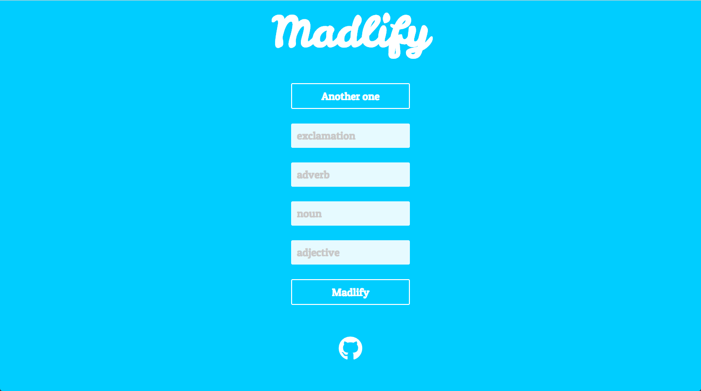
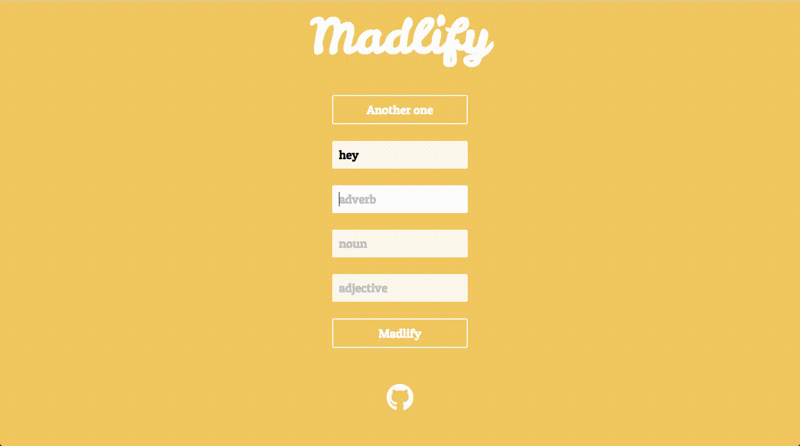
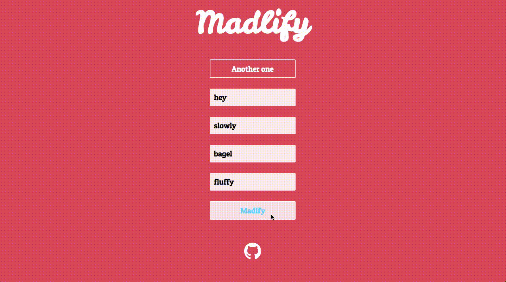

# Madlify

Your favorite childhood game of [MadLibs](https://en.wikipedia.org/wiki/Mad_Libs), now in cooler colors and on the web. Madlify is a phrasal template word game, where you fill in the blanks with parts of speech.

## Features 

Fill in the list of words 

Watch a story unfold before your eyes 

## Built With
* [React](https://reactjs.org/) - JavaScript library 
* CSS/HTML 
* [Create React App](https://github.com/facebookincubator/create-react-app) - Creates React apps

## Acknowledgments 
* Mom for buying me my first MadLibs booklet 

## To do
- [x] ~~Utilize [Madlibz API](https://madlibz.herokuapp.com/api) to get stories~~ 
- [ ] Expand on my own stories API
- [x] Alternate colors on load
- [ ] Show user the definition of chosen part of speech 
- [x] Responsive for mobile and web 
- [x] Add button to my Github 

