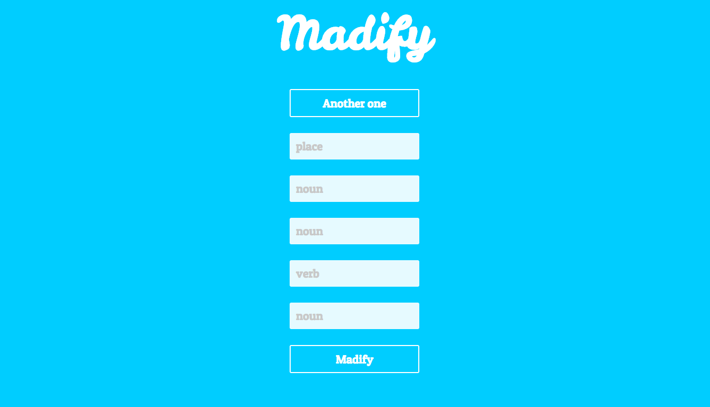
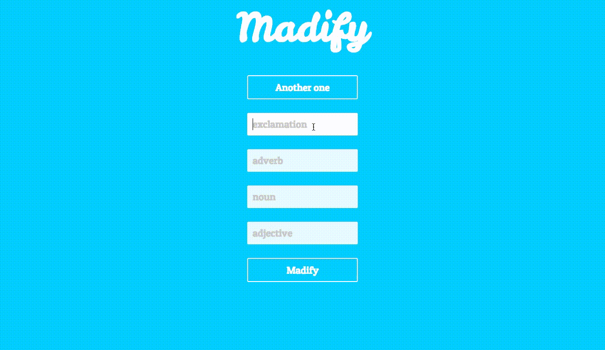
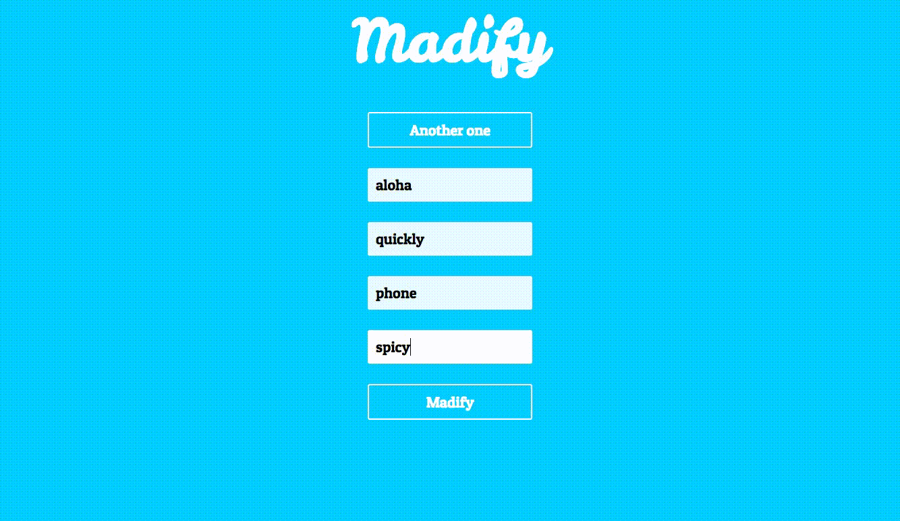

# Madify

Your favorite childhood game of [MadLibs](https://en.wikipedia.org/wiki/Mad_Libs), now in cooler colors and on the web. Fill in the blanks with corresponding parts of speech and watch the story unfold. 




## Getting Started

Follow these instructions to get a copy of the project running on your local machine for development and testing purposes.


### Prerequisities

Clone the repo. Go into terminal and navigate to the root folder. Initialize npm:

```
npm init
```

### Installing

```
npm install
```

To run app on development mode:

```
npm start
```

To run on test mode: 
``` 
npm test 
``` 

Open http://localhost:3000 to view the word game in the browser.






## Built With
* [React](https://reactjs.org/) - JavaScript library 
* CSS/HTML 
* [Create React App](https://github.com/facebookincubator/create-react-app) - Creates React apps


## Acknowledgments 
* Mom for buying me my first MadLibs booklet 


## To do
* ~~Utilize [Madlibz API](https://madlibz.herokuapp.com/api) to get stories~~ Expand on my own API
* ~~Alternate colors on load~~
* Show user the definition of chosen part of speech 
* Responsive for mobile and web 

